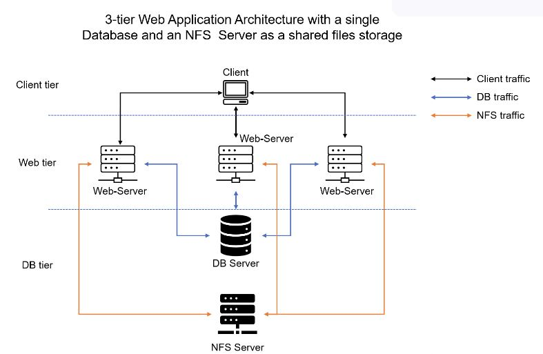

## Project-7-Devops-Tooling-Website-Solution

Task : Develop Tooling wbesite Solution

### STEP 1 – PREPARE NFS SERVER ###

- Spin up a new EC2 instance with RHEL Linux 8 Operating System.

- Configure LVM on the Server. Instead of formating the disks as `ext4` you will have to format them as `xfs`. Ensure there are 3 Logical Volumes. `lv-opt`, `lv-apps`, and `lv-logs`.

Create mount points on /mnt directory for the logical volumes as follow:

Mount `lv-apps` on /mnt/apps – To be used by webservers.

Mount `lv-logs` on /mnt/logs – To be used by webserver logs.

Mount `lv-opt` on /mnt/opt – To be used by Jenkins server